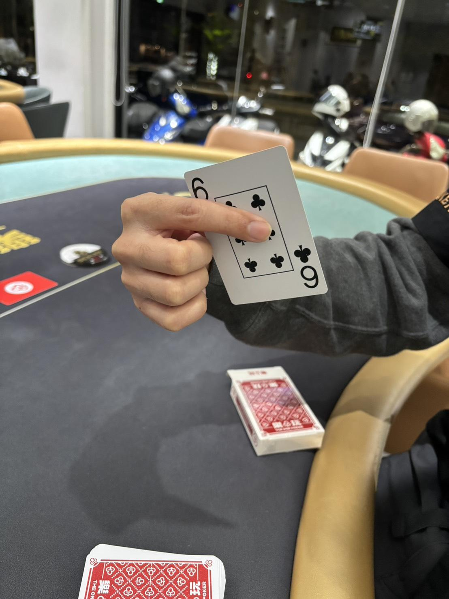
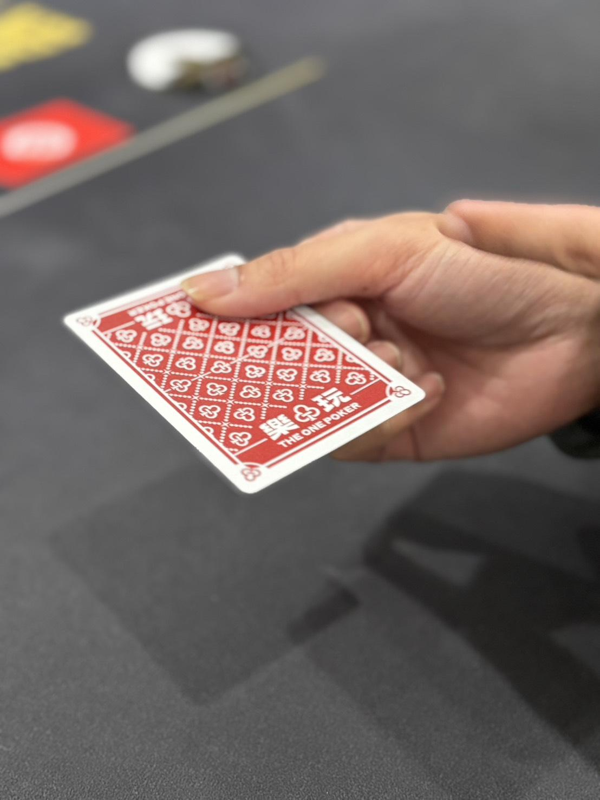
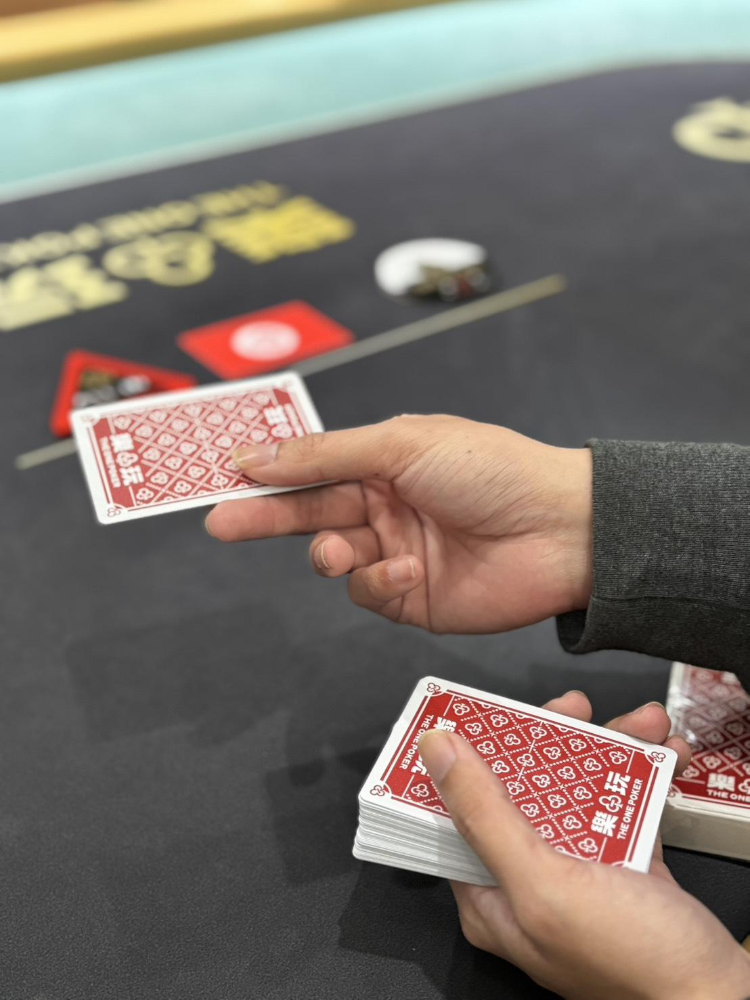
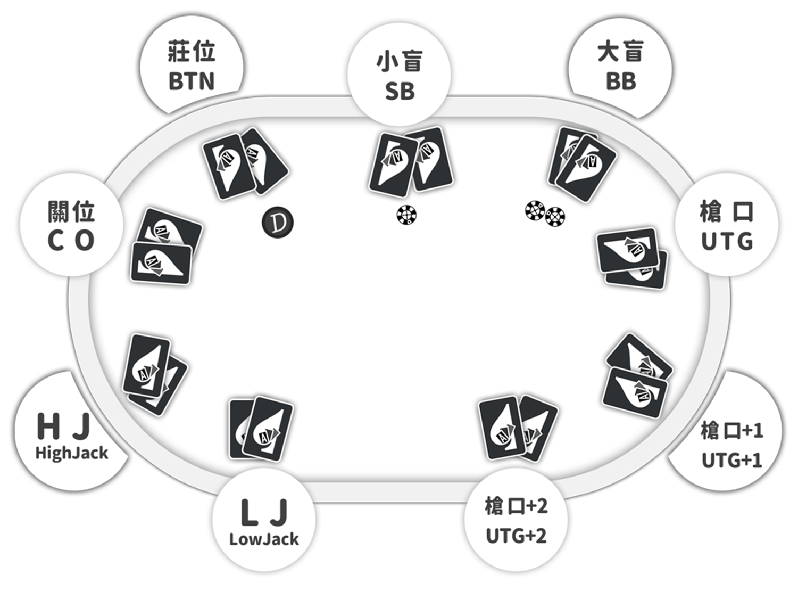
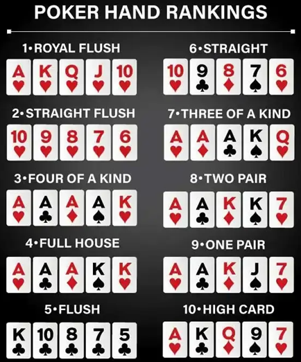

# 📅 DAY 1｜培訓課表

# DAY 1：基礎動作＋規則入門

::: tip
📋

**5 天培訓總覽**

- DAY 1：基礎動作＋規則入門
- DAY 2：點碼＋下注判定
- DAY 3：考核：牌力＋主邊池
- DAY 4：異常狀況＋違規處理＋考核
- DAY 5：整合實作＋外場＋總考核
:::

---

## PDF 原始課表（完整 5 天表格）

| DAY 1 | 時間 | 內容 | DAY 2 | 時間 | 內容 | DAY 3 | 時間 | 內容 | DAY 4 | 時間 | 內容 | DAY 5 | 時間 | 內容 |
| --- | --- | --- | --- | --- | --- | --- | --- | --- | --- | --- | --- | --- | --- | --- |
| 培訓流程說明 | 30 | 1.培訓期間為5天, 未能通過考核者,不錄用
2.需預先排定培訓課程時間
3.已排定的時間, 請假超過3小時即不錄用
4.通過培訓有培訓津貼3000元
5.同時會有多人培訓, 可能會有無職缺情況 | 洗牌、射牌動作調整 | 30 | 持續校正動作 | 洗牌、射牌動作調整 | 30 | 持續校正動作 | 洗牌、射牌動作調整 | 30 | 持續校正動作 | 洗牌、射牌動作調整 | 30 | 持續校正動作 |
| 洗牌、射牌動作解析 | 30 | 洗牌順序＋要領、射牌握牌與施力 | 點碼動作及排列方式（口訣） | 30 | 攤碼、勾碼技巧 | 判斷牌力考試 | 30 | 及格標準：80分以上 | 級距/主邊池考試 | 30 | 及格標準：80分以上 | 細部規定 | 30 | 1.加入遊戲判定
2.離座處理
3.錯誤發牌 |
| 遊戲規則介紹（荷官手冊） | 30 | 1.座位認識
2.勝負判定
3.發牌流程
4.翻牌前/翻牌後流程
5.盲注
6.攤牌順序 | 下注規定/級距計算 | 30 | 1.無玩家下注情況下的最小加注
2.有玩家下注情況下的最小加注
3.下注尺寸是否需補至最小加注
4.玩家是否能夠再加注計算 | 點碼模擬 | 30 | 1.60顆,面額5000以下
2.模擬玩家all in 點碼
3.模擬多家all in 處理 | 開桌流程 | 30 | 驗牌、抽BTN、確認座位卡與計時器 | 犯規處理 | 30 | 1.常見犯規情形
2.口頭勸導方式
3.叫floor時機 |
| 遊戲規則介紹（荷官手冊） | 30 | （延續） | 下注規定/級距計算 | 30 | （延續） | 主邊池計算模擬 | 30 | 1.多位玩家攤牌模擬
2.多家all in 模擬 | 模擬練習 | 30 | 整合前三天所學 | 模擬練習 | 30 | 整合前四天所學 |
| 判斷牌力技巧（範例） | 30 | 快速判讀牌型、比較踢腳牌 | 玩家行動判讀 | 30 | 1.常見check方式
2.籌碼放置含意 | 錯誤發牌/有效動作 | 30 | 何時可宣告錯發、有效行動判定 | 錯誤發牌/有效動作 | 30 | 複習 | 外場工作 | 30 | 1.點碼,Key編號
2.收位卡,確認人數
3.拆桌,併桌 |
| 洗牌、射牌動作調整 | 30 | 持續練習與校正動作 | 發牌模擬 | 30 | 1.分析每一個環節的動作處理原則
2.覆誦,收牌,洗牌的同時處理
all in攤牌時機 | 認識比賽類型/資訊 | 30 | 錦標賽/限時錦標賽 | 洗牌、射牌動作調整 | 30 | 最終調整 | 考試 | 30 | 總考核 |
|  |  |  |  |  |  | 荷官禮儀（荷官手冊） | 30 | 1.公平公正專業
2.控制節奏
3.不參與牌局
4.了解比賽資訊 |  |  |  |  |  |  |

---

## 課程時間表

### 第一節｜培訓流程說明（30 分鐘）

**培訓規則說明**

1. 培訓期間為 5 天，未能通過考核者不錄用
2. 需預先排定培訓課程時間
3. 已排定的時間，請假超過 3 小時即不錄用
4. 通過培訓有培訓津貼 3000 元
5. 同時會有多人培訓，可能會有無職缺情況

---

### 第二節｜洗牌／射牌動作解析（30 分鐘）

**對應教材**：第一章 → 1. 洗牌、2. 射牌

#### 洗牌

**洗牌順序**：大洗 > 整理整齊 > 彈牌 2 次 > 切牌 3 次 > 彈牌 1 次 > 將牌切到紅卡底牌上 > 完成洗牌放到手上

**洗牌要領**

1. **大洗**：將牌 Z 字形打亂 > 將牌收攏至一個手掌大小 > 將牌左右搖晃至 90 度交疊後整理整齊
2. **彈牌**：左右手以中間點為分界，以中指與無名指將牌堆分成兩半 > 食指靠上牌的側邊將牌整理整齊 > 兩支手向外轉 45 度角 > 食指壓住牌背角落用大拇指向上撥將牌彈下左右交疊
3. **切牌**：左手將牌微微拿起 > 以中指無名指將部分牌堆切開，放下時以食指點住避免牌堆滑開
4. **牌切到紅卡上**：先將紅卡拿至面前，將牌堆切至紅卡上（兩次），以同一隻手完成切牌

**影片｜洗牌示範**

[百分比E6百分比B4百分比97百分比E7百分比89百分比8C百分比E6百分比95百分比99百分比E5百分比AD百分比B8.mp4](百分比E6百分比B4百分比97百分比E7百分比89百分比8C百分比E6百分比95百分比99百分比E5百分比AD百分比B8.mp4)

#### 射牌

射牌：將牌擺正向右轉 45 度以食指跟大拇指拿住（拇指約在樂字左右，食指伸直於牌下方中間）

食指不超出牌背上方，中指抵住牌的中線，中指施力向前向下推出（切記施力均勻）。

食指跟拇指在中指推出時稍晚放開，使牌產生旋轉，越晚放開則牌越會向右方飛出。

射牌以右手為主，左手將牌推出至右手中。

**影片｜射牌示範**

[百分比E5百分比B0百分比84百分比E7百分比89百分比8C.mp4](百分比E5百分比B0百分比84百分比E7百分比89百分比8C.mp4)

---

### 第三節｜遊戲規則介紹（30 分鐘）

**對應教材**：第三章 → 1～4

#### 1. 德州撲克座位（建議 9～10 人桌）

**基本概念**

德州撲克可 2～10 位玩家同桌，最常見為 9～10 人桌。

座位自荷官位置起，通常按順時針方向編號；最後行動的位置（Button 後方）

#### 2. 大盲、小盲與按鈕位

**按鈕（Button）**

- 每局結束後，按鈕順時針移動至下一位玩家
- 翻牌後下注時，位於按鈕左邊的玩家先行動

**小盲（SB）**

- 按鈕左手邊的第一位玩家，需在該輪開始前投入小盲注

**大盲（BB）**

- 小盲左手邊玩家，需投入通常為小盲 2 倍的大盲注

#### 3. 德州撲克基本流程與勝負判定

每位玩家會獲得兩張底牌，並在下注輪的過程中逐步翻開公共牌，最終場上將有五張公共牌。

若在攤牌階段前，牌局中只剩下一位玩家未棄牌，則該玩家自動獲勝並贏得底池。

若仍有兩位（含）以上的玩家保留到攤牌階段，則每位玩家須從自己的兩張底牌與場上五張公共牌（共七張）中選出五張組成最佳牌型，比較牌力來決定贏家。

#### 4. 順時針進行動作

**Pre-Flop 首輪下注**

每位玩家確認兩張底牌後，自大盲左手邊的玩家開始行動；可選擇棄牌（Fold）、跟注（Call）或加注（Raise）。

**翻牌／轉牌／河牌／攤牌**

- **翻牌（Flop）**：燒牌（Burn）一張後，翻開三張公共牌（Community Cards）
- **轉牌（Turn）**：再燒牌一張後，翻出第四張公共牌
- **河牌（River）**：最後再燒牌一張後，翻出第五張公共牌
- **攤牌（Showdown）**：從自己的兩張底牌與場上五張公共牌（共七張）中選出五張組成最佳牌型，比較牌力來決定贏家

每個階段結束，都會有一輪下注。

若玩家投注額度達成一致，即結束該輪並進入下一階段。

---

### 第四節｜遊戲規則介紹（延續 30 分鐘）

**對應教材**：第三章（延續）

繼續深入講解翻牌前/翻牌後流程、盲注、攤牌順序等內容。

---

### 第五節｜判斷牌力技巧（範例）（30 分鐘）

**對應教材**：第三章 → 5. 判斷牌力技巧

#### 牌力大小（由大至小）

> 皇家同花順（Royal Flush） > 同花順（Straight Flush） >
> 

四條（Four of a Kind） > 葫蘆（Full House） > 同花（Flush） >

順子（Straight） > 三條（Three of a Kind） > 兩對（Two Pair） >

一對（One Pair） > 高牌（High Card）

相同牌型時比較踢腳牌（Kicker）。

若仍無法分出勝負，則平分底池。

**練習重點**

- 快速辨識牌型
- 比較同牌型時的大小
- 理解踢腳牌（Kicker）的作用
- 判斷平手（Split Pot）情況

---

### 第六節｜洗牌／射牌動作調整（30 分鐘）

**練習目標**

- 持續校正動作
- 提升流暢度與速度
- 培訓師個別指導
- 發現並改正錯誤習慣

---

## 當日檢核表

### 必備知識確認

- [ ]  了解培訓規則與要求
- [ ]  熟悉洗牌標準流程（大洗 > 彈牌 2 次 > 切牌 3 次 > 彈牌 1 次）
- [ ]  掌握射牌握牌姿勢與施力技巧
- [ ]  認識德州撲克座位配置（BTN、SB、BB、UTG 等）
- [ ]  理解盲注機制
- [ ]  熟悉發牌基本流程（Pre-Flop、Flop、Turn、River、Showdown）
- [ ]  能判斷所有牌型大小
- [ ]  理解踢腳牌（Kicker）概念

### 動作技能確認

- [ ]  洗牌動作正確但可能不夠流暢（第一天屬正常）
- [ ]  射牌能射出但準確度待加強
- [ ]  能完整覆誦一次發牌流程

---

## 培訓師提醒

**第一天重點**

- 建立正確的基礎動作習慣（寧可慢，不可錯）
- 確認新人理解遊戲規則的基本邏輯
- 不要急著追求速度，先求穩定

**常見問題**

- 射牌時手指施力不均導致牌飛偏
- 洗牌時彈牌沒有交疊整齊
- 混淆座位順序（特別是 UTG 位置）

**下課前確認**

- 新人能獨立完成一次完整洗牌
- 新人能說出完整的發牌流程
- 新人能正確辨識所有牌型
