# 櫃檯場控／佑恩

## 櫃檯／場控

> 這一頁偏「操作圖解＋細節」，手冊本體已整理成「章節版 SOP」。
> 

> 若要快速掌握流程，請先看：[荷官手冊](/荷官手冊) →「第八章：櫃檯／場控作業」。
> 

### 1｜櫃檯的角色與重點

櫃檯是玩家進入現場後第一個接觸到的角色，需要在第一時間招呼、判斷玩家身分，並提供符合需求的引導。

同時櫃檯也是最常接觸現金的崗位，每日經手金額大，任何小失誤都可能造成短溢。因此櫃檯必須細心，並對金錢保持高敏感。

另外也需隨時更新社群軟體，回覆訊息等細項工作。

### 2｜基礎櫃檯觀念與操作

收銀是櫃台最基礎需要做的事情過程中需要在最忙碌時用最短的時間將收到的錢放到正確的位子並且key in pos系統對於工具系統的熟悉度就會相當重要

第一項:pos使用方式

新會員辦理:

需要辦會員的原因是為了確認玩家是否成年來保障玩家與協會間的權益另外也要留下玩家的基本聯絡資料方便處理之後遇到需聯絡玩家時的狀況發生

在辦會員時我們會使用到的工具有POS系統 POKER CLUB 以及POKER FANS

執行流程時務必依照規定操作確保玩家有成功並正確的登入會員

操作流程:

掃玩家POKER FANS>POS系統登入>借實體證件>確認是否是學生借線上課表/學生證或登入校務系統>詢問手機號碼(課表跟學生證要看是這個學年度)

POS系統頁面

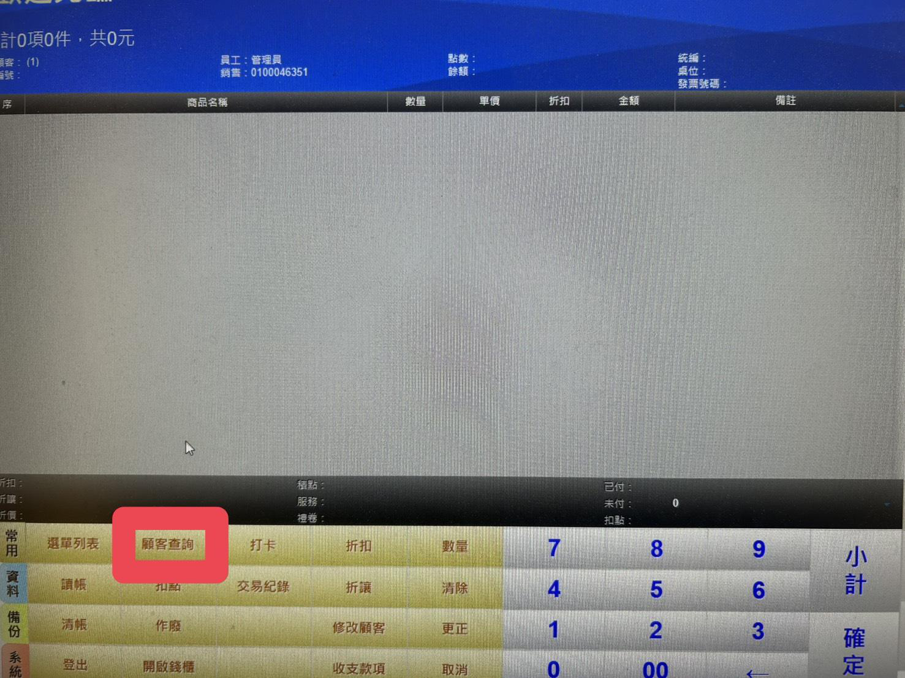

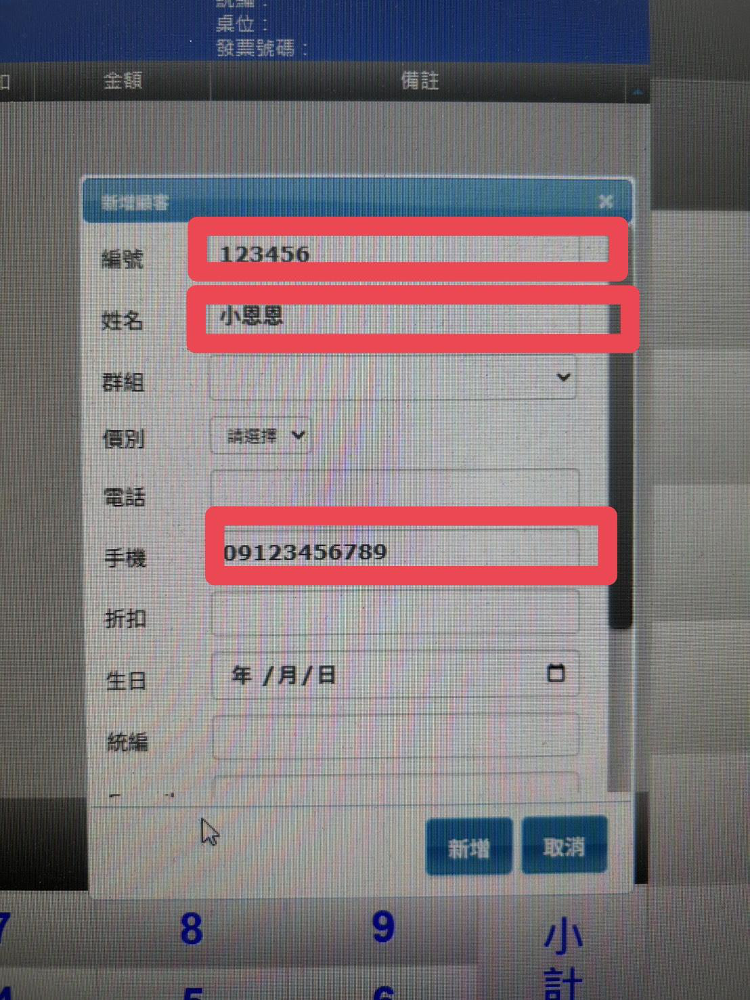

圖片1 圖片2

點擊圖片1顧客查詢並打入玩家的編號按下ENTER後會跳出圖片2的畫面輸入玩家名字以及手機電話按下新增就完成新會員登入

常見問題及解決辦法

櫃台/場控

沒有實體證件

1.學生有大學校務系統或是線上學生證請客人登入並一起出示證件電子檔核對姓名這 麼做一方面能確定玩家是否成年另一方面則可以確保大學系統沒有造假或借他人的 系統來辦會員

2.非學生沒有攜帶實體證件則無法讓該客人登入會員因為無法確認他是否成年3.非學生但明顯成年的客人屬於彈性範圍只要他拿的出電子檔就可以讓客人能夠辦會 員

出示大學課表/學生證截圖

截圖的課表以及學生證電子檔/照片一律不接受

無法下載POKER FANS或無法登入

當遇到時會有兩種情形(為甚麼會只能收驗證信

1.能收驗證信: 借公司平板給客人創帳號再請客人從自己手機收驗證信創辦完帳號且 幫客人完成辦會員在請客人將自己得編號記下

2.不能收驗證信: 委婉的告訴玩家若沒有辦法收驗證信則無法加入比賽

(沒有台灣手機號)

收銀:

收銀最大重點必需要把接過手的錢攤出來確認金額無誤如果遇到較高級別的報名或是客人一次幫多個玩家報名則需要過點鈔機確認金額無誤要這麼做的原因是為了讓有發生金額錯誤時可以用監視器來回朔哪個環節出錯減少需要賠償營收的可能性

**流程操作**

點POS系統顧客查詢>詢問客人會員編號並輸入>螢幕左側選擇級別>點擊小記再按確認>將級別獎金放進獎池>服務費放進收銀機

級別獎金與服務費介紹

撲克協會的收取費用是獎金(結算獎金)+服務費(店家利潤)

櫃台/場控

舉例:

1200限時錦標賽 1000(獎金)+200(服務費)以此類推

POS系統頁面

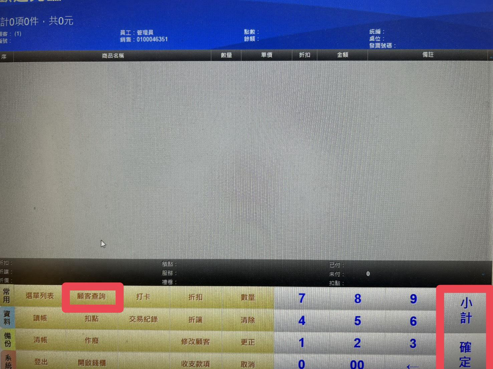

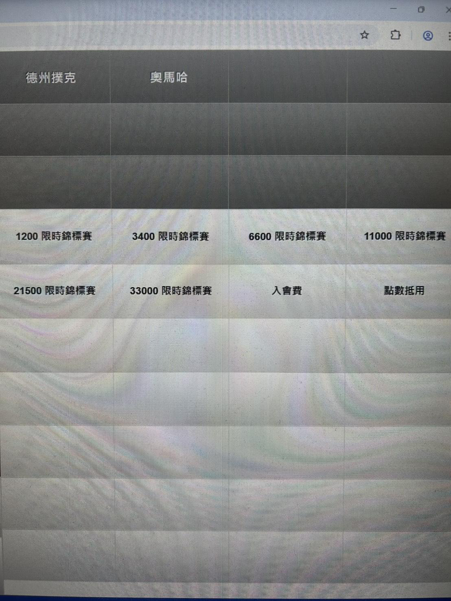

圖片1 圖片2

點擊顧客查詢輸入玩家編號在按下ENTER就會跳出客人的名字在到右側點選客人選擇級別按下小記確認就完成結帳

### **常見問題及解決方法**

查無該玩家的編號

有些玩家因為各種原因會更改POKER FANS的編號所以我們的POS系統可能會查詢不到也有可能玩家忘記自己的編號這時候可以詢問玩家的手機電話也能查詢的到如果再沒有則需要確認客人是否有到過其他分店若以上都沒有就得請客人辦入會

**作廢:**

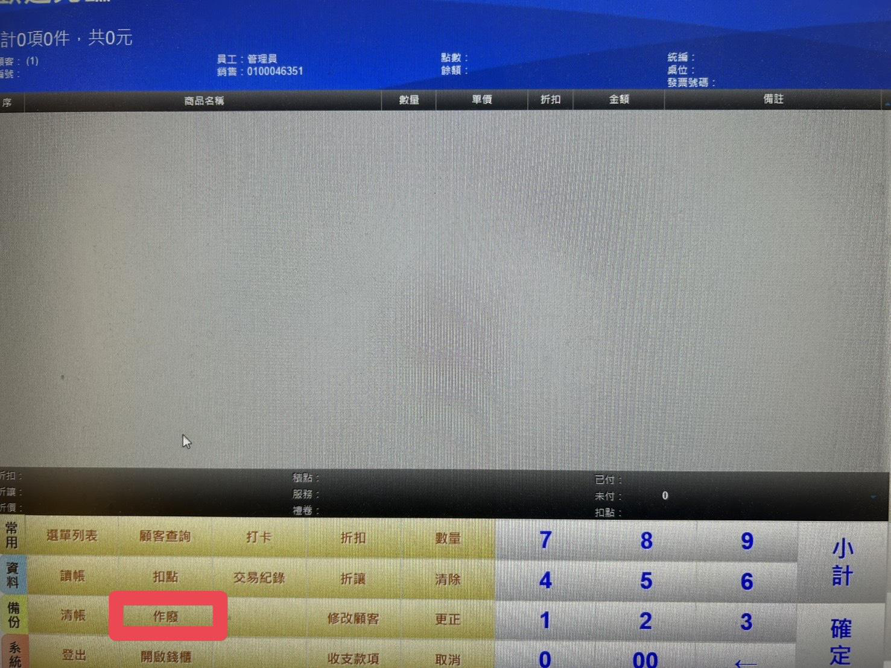

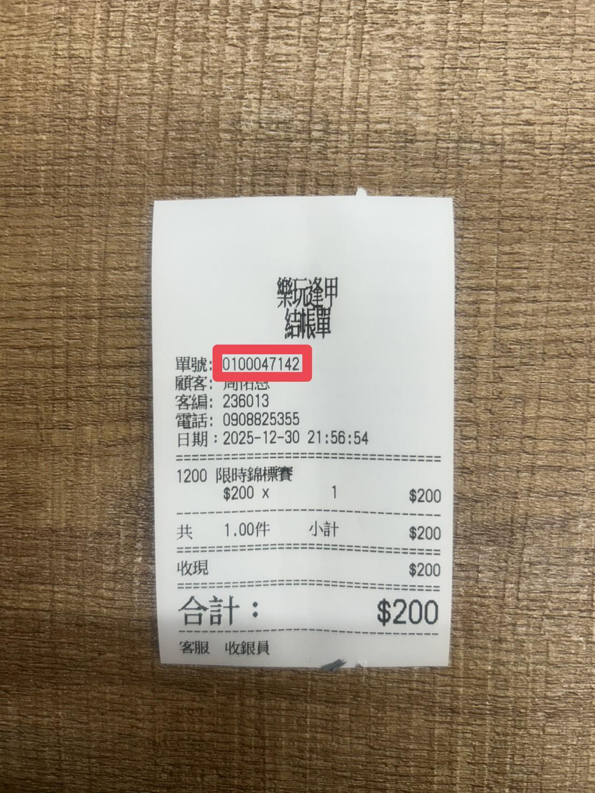

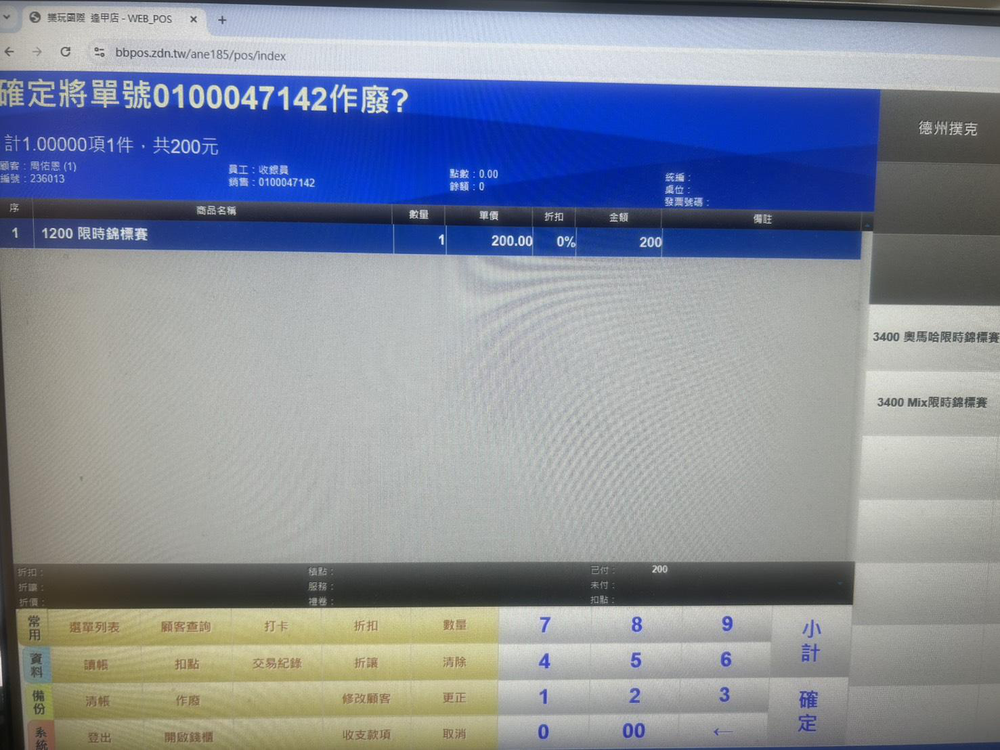

圖片1 圖片2 圖片3

先點擊系統裡作廢再key進圖片2裡小白單裡最上行單號再點擊ENTER會跳到圖片3的頁面確認小白單以及頁面的場次資料是否相同如果相同再次按下ENTER就完成作廢

櫃台/場控

折扣/折讓/扣點:

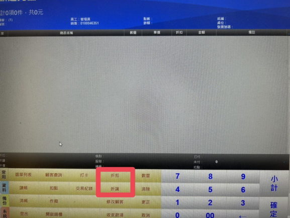

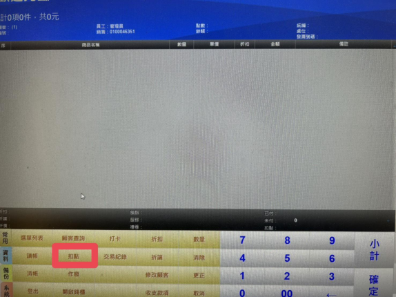

圖片1 圖片2

差別與操作

舉例

客人要報名3400 如果有服務費半價的優惠就有以上兩種方式可以處理

(以下說明都是上述提及收銀步驟到選取級別後的動作)

1.折扣: 輸入50再按折扣顯示的金額就會變成3200

2.折讓: 輸入200再按折讓顯示的金額就會變成3200

折扣就是用%數計算折讓則是用折多少錢計算

3.有時候會有活動送玩家點數點數是用來折玩家服務費只能折抵服務費無法扣除獎池的獎金例如1200最多只能折抵200

玩家使用時的操作(以下說明都是上述提及收銀步驟到選取級別後的動作)

圖片1(折扣折讓) 圖片2(扣點)

如果遇到玩家點數不夠只能扣部分點數的話就必需按上圖中數字欄按下剩餘點數的數量並按扣點然後按小記再確認就完成操作

清帳

????

### 第二項:獎金/營收/小白單放置

**櫃台/場控**

上述有提及限時錦標賽的報名費是由級別獎金+服務費組成在協助玩家報名時需要將POS輸入完接收到獎金營收以及小白單放置到正確的位子讓櫃台有條理如有錯誤也方便回朔錯誤是從哪裡發生

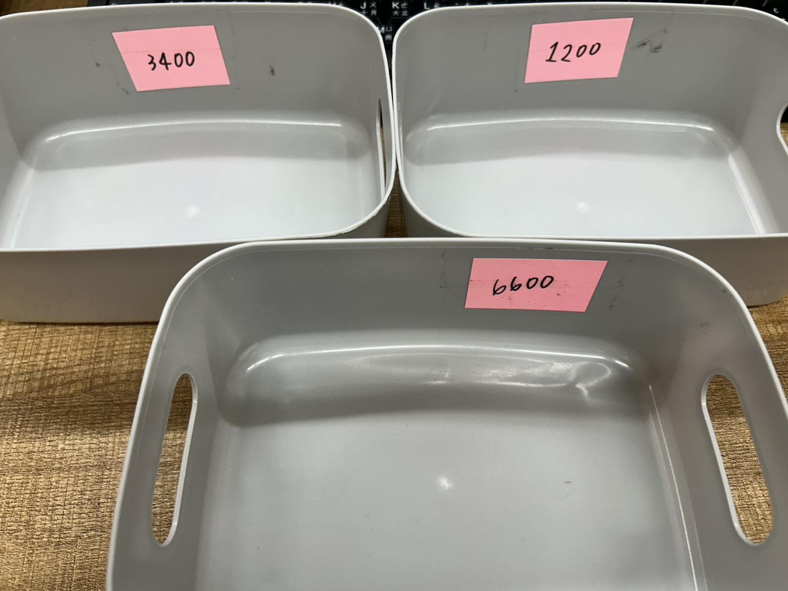

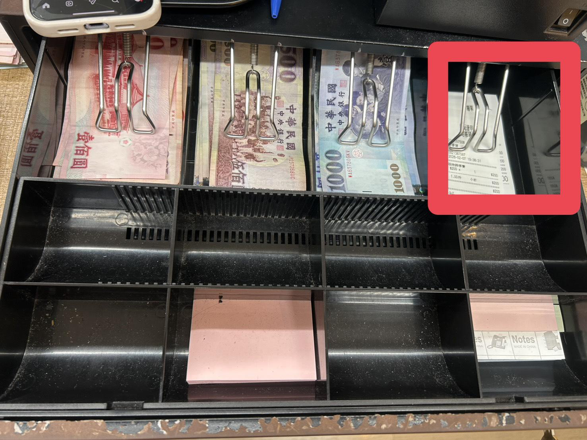

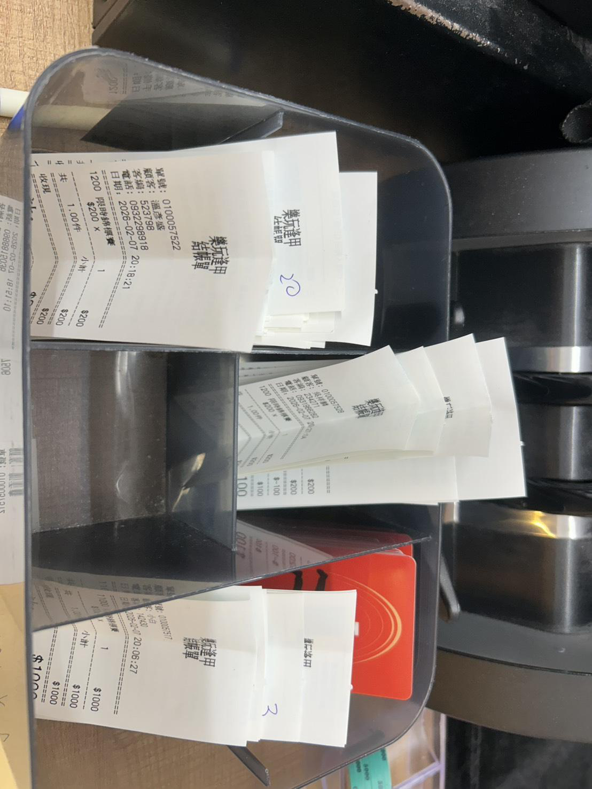

圖片1 圖片2 圖片3

圖片1是用於放置獎金的盒子各級別都會有相對應的盒子

圖片2是放入營收(服務費)放置的方法就是不同面額分開放則右邊框起的部分釋放當日有作廢的作廢單

圖片3是POS機出單時要將小白單依級別放入格子中

### 第三項:獎金處置

比賽的最後30分鐘截買時間意思是不會再有玩家買入這時候我們需要更換當場次比賽的獎金以便結束時發放獎金

換鈔方式:

6600以下級別

更換3000的散鈔 500*3 100*15

6600以上級別

更換4000的散鈔 500*4 100*20

### 第四項:poker club

poker club 是目前普遍協會會用來登入會會員以及開比賽用的程式因為會經常使用所以必須要熟知操作方式進而增加工作效率

**登入會員**

櫃台/場控

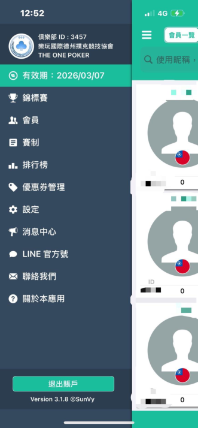

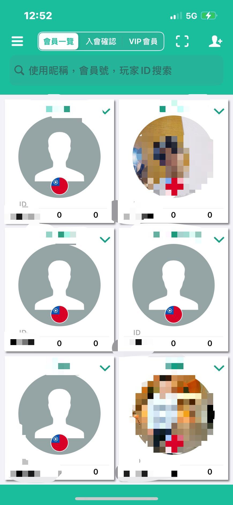

新會員登入必需先點擊圖片1的"會員” 就會跳出圖片2的畫面點取右上角掃描的圖示並掃玩家的QR CODE 就完成新增會員

**開賽事**

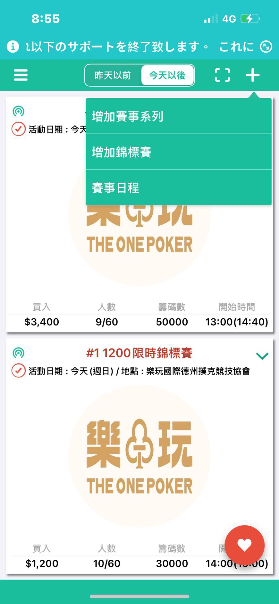

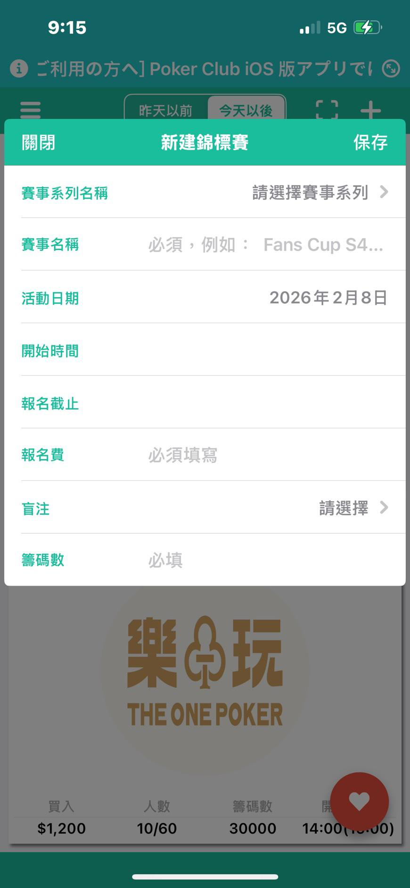

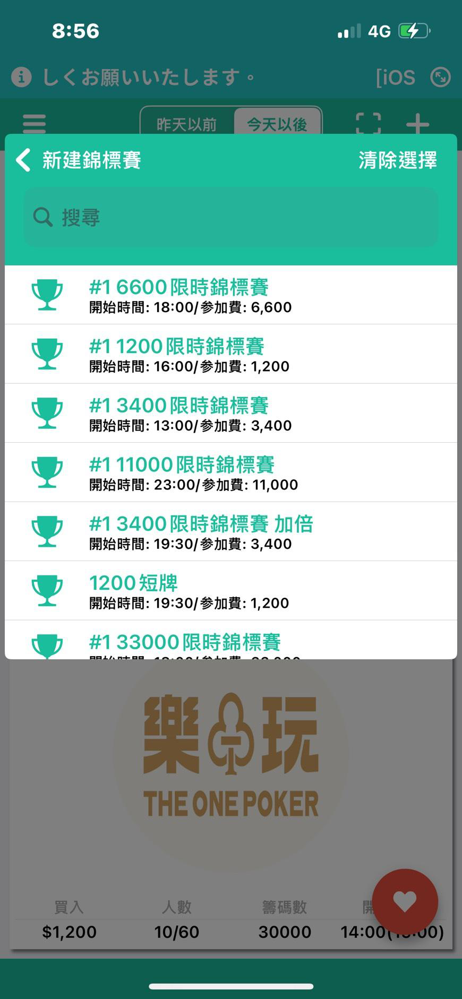

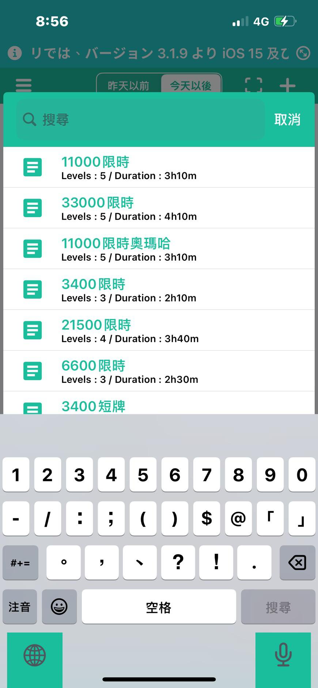

圖片1 圖片2 圖片3 圖片4 圖片5

步驟1 點擊圖片1左側的錦標賽會跳到圖片2的畫面並點即右上角+號

步驟2 點完+號會出現圖片3的畫面點"選擇賽事系列”會跳出圖片4的畫面

步驟3 選擇當下要開啟的場次例如:要開6600德州就選擇"6600限時錦標賽”

步驟4 選擇好級別需要調整時間如果時間已經跨到隔夜那時間以營業日為主例如:2/5營業跨到2/6 那時間設定只需要設定2/5 23:00即可

步驟5 在點選盲注後選擇相對應級別選好後按下保存就完成整個開賽事的流程

### 賽事結算(key 獎池)

**櫃台/場控**

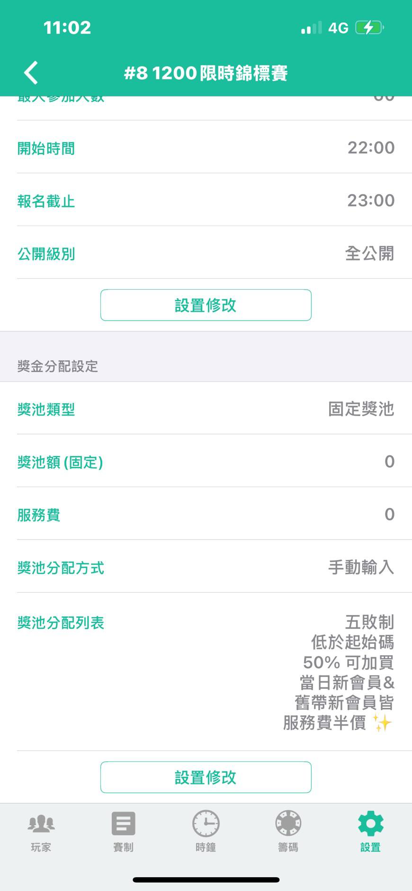

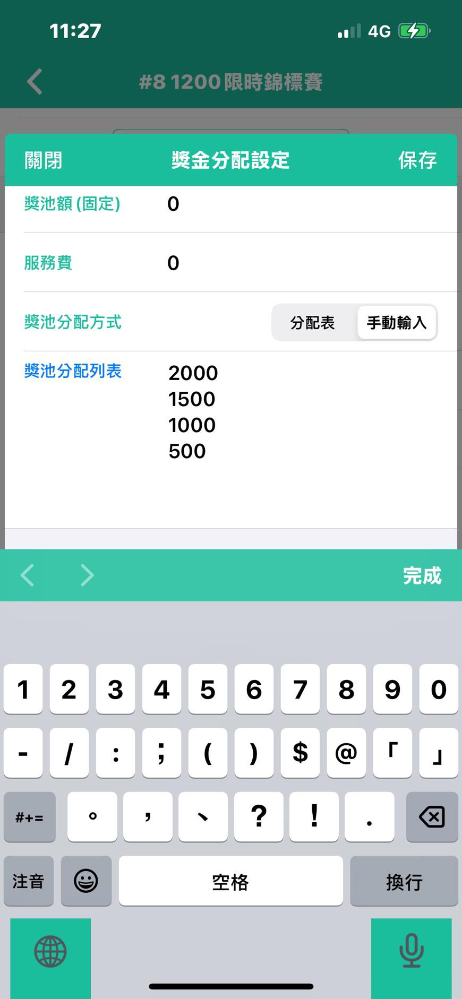

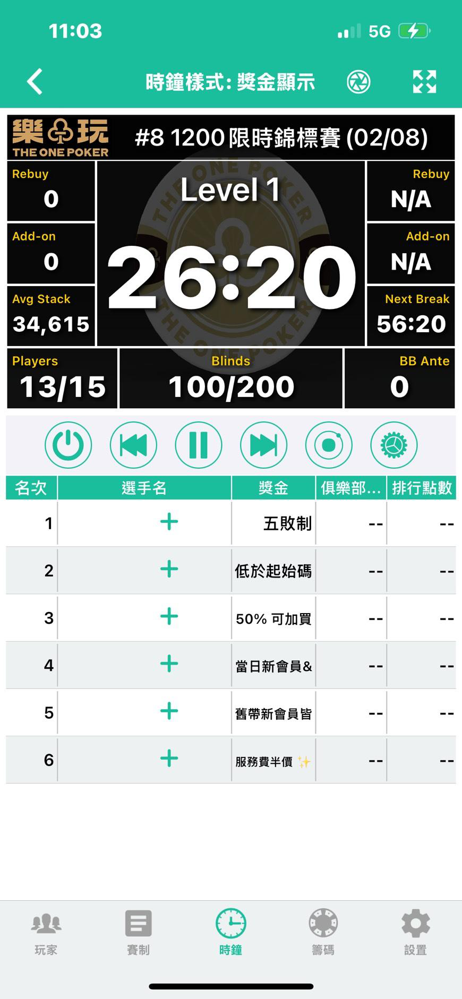

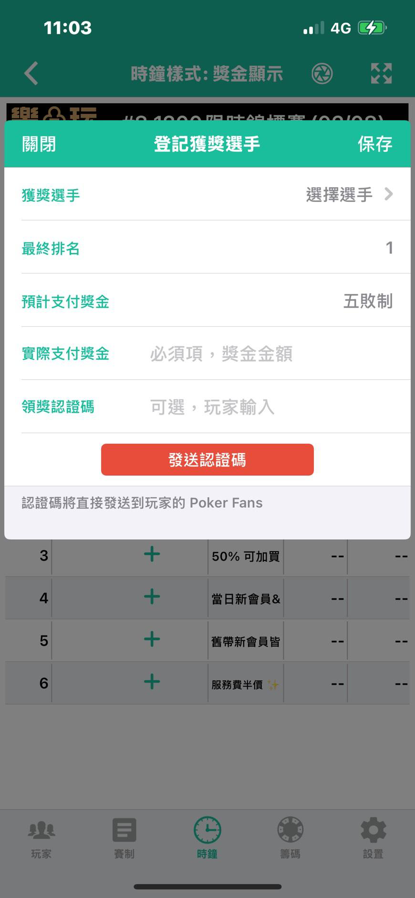

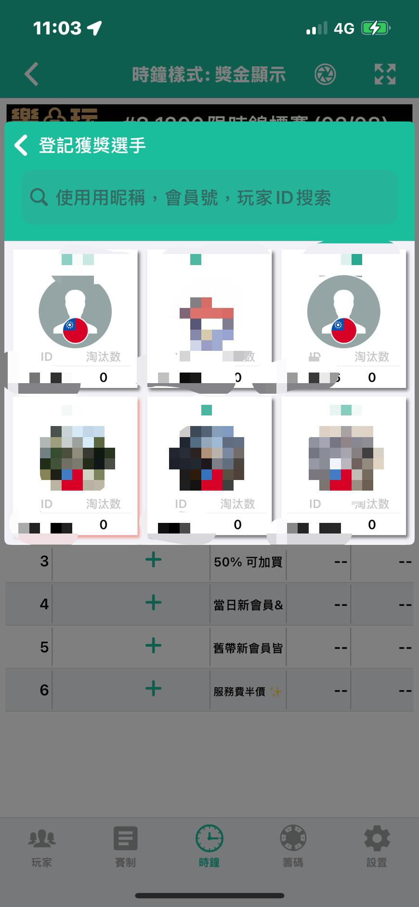

圖片1 圖片2 圖片3 圖片4 圖片5

步驟1 點選要key in的場次點選後圖片1右下角有設定並滑到獎金分配設定欄

步驟2 按下設置修改將獎金分別打上並按下保存

步驟3 保存後按回時鐘點擊+號就會跳到圖片4的頁面

步驟4 點擊"選擇玩家”後會跳到圖片5並依照名次填玩家

步驟5 選好玩家會跳回圖片4 然後實際支付獎金那欄填寫給出的獎金再按下保存即完成

第二段:招呼

第三段:活動

第四段:客服/賽事

第二節:場控的職責

